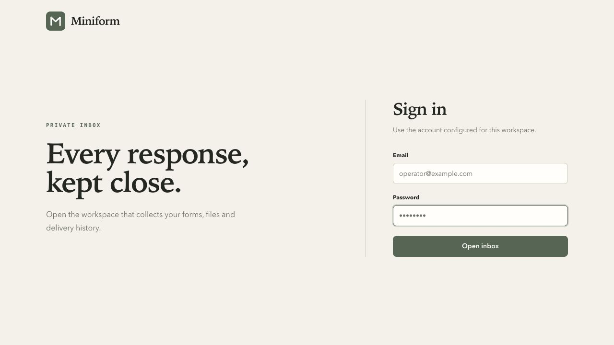
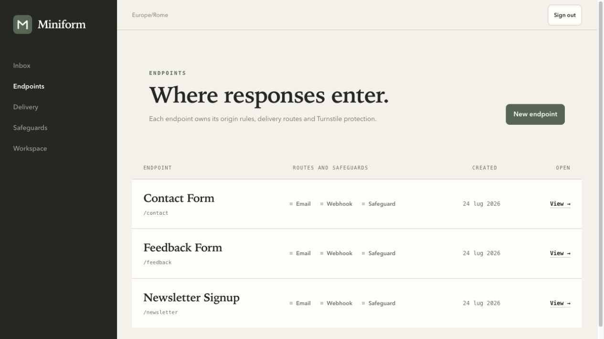
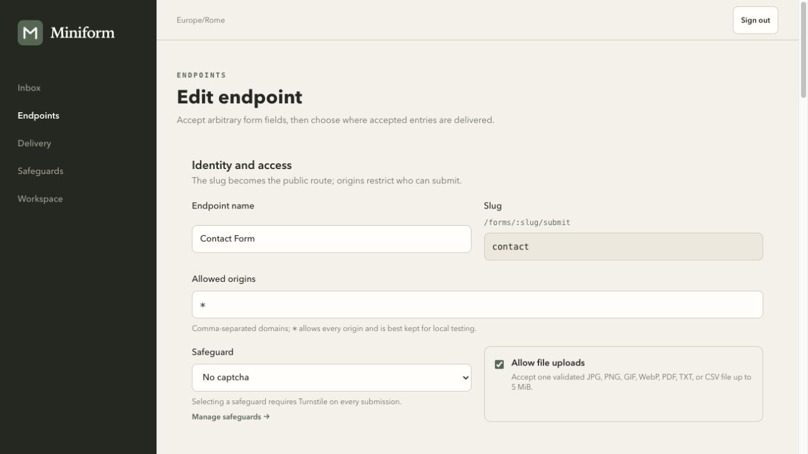
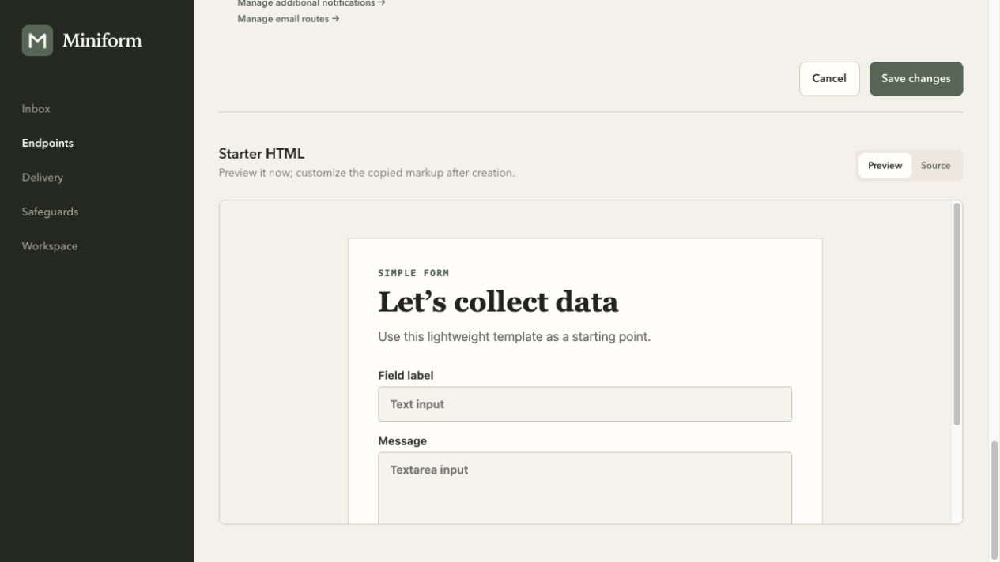

# Miniform

[](https://github.com/matteodante/miniform/actions/workflows/ci.yml)
[](https://github.com/matteodante/miniform/actions/workflows/codeql.yml)
[](https://github.com/matteodante/miniform/releases/latest)
[](https://github.com/matteodante/miniform/pkgs/container/miniform)
[](LICENSE)

**A quiet, self-hosted inbox for form submissions.**

Miniform accepts submissions and file uploads from any HTML form, stores them in SQLite, and forwards them to webhooks or SMTP. It ships as one Go binary and one OCI image, with no hosted account or external database.

The current stable release is [`v0.2.3`](https://github.com/matteodante/miniform/releases/tag/v0.2.3). Pin an exact release or image digest in production; `main` remains the development branch.

## Interface

| Sign in | Endpoints |
|---|---|
|  |  |
| Endpoint editor | Starter HTML |
|  |  |

## Why Miniform

- Private, searchable inbox for submissions and files
- Independent forms with tokens and allowed-origin policies
- Retried webhook and email delivery with visible history
- Bounded request resources, dual rate limiting, origin checks, security headers, and per-endpoint Turnstile
- Opt-in signature-validated uploads with a storage quota, durable delivery queues, and SQLite persistence in a single process
- Native HTML forms and direct HTTP requests with no client library
- Multiple per-form SMTP notifications with independent recipients, Reply-To, templates, status, and retries

## Quick start from source

Requirements: Go 1.26.5, a C compiler, Node.js 24 or newer, and `make`.

```bash
git clone https://github.com/matteodante/miniform.git
cd miniform
cp .env.example .env
make bootstrap
make run
```

Open <http://127.0.0.1:8080>. On the first boot, Miniform prints a unique temporary admin password to the terminal. The first sign-in is restricted to password replacement; the rest of the workspace opens only after that succeeds.

For a disposable local instance with sample data and a working submission page:

```bash
make demo
```

Open <http://127.0.0.1:8080/_demo>. The isolated admin account is `admin@miniform.local` with password `miniform`, and its data stays under `tmp/demo`.

## Run in a container

The public multi-architecture image supports Linux `amd64` and `arm64`:

```bash
docker pull ghcr.io/matteodante/miniform:v0.2.3
docker volume create miniform-data
docker run --rm --name miniform \
  --publish 8080:8080 \
  --env MINIFORM_ENV=development \
  --volume miniform-data:/app/storage \
  ghcr.io/matteodante/miniform:v0.2.3
```

To build the same OCI-compatible image locally, run `docker build --tag miniform:local .`.

On Apple silicon with macOS 26 and the official [`apple/container`](https://github.com/apple/container) CLI:

```bash
make apple-container-run
make apple-container-health
make apple-container-stop
```

The Apple Container workflow stores development data in the persistent `miniform-data` volume; stopping the container does not delete it. On first use after upgrading from the old bind-mount workflow, `make apple-container-run` copies an existing project `storage/` directory into the new volume and keeps the source directory for recovery.

Production mode requires HTTPS and a persistent `MINIFORM_SESSION_SECRET`. See the [installation guide](docs/installation.md) before exposing Miniform to the internet.

Miniform is intentionally a single-writer deployment. Stop the previous process before starting a replacement, and back up uploaded files together with the SQLite database when a point-in-time restore is required. Managed installation, upgrade, backup, and restore behavior is documented in the installation guide.

## Documentation

- [Installation and upgrades](docs/installation.md)
- [Configuration reference](docs/configuration.md)
- [Submitting forms and HTTP API](docs/submitting-forms.md)
- [Email notifications and templates](docs/email-notifications.md)
- [CLI reference](docs/cli.md)
- [Architecture](docs/architecture.md)
- [Development guide](docs/development.md)
- [Troubleshooting](docs/troubleshooting.md)
- [Release process](docs/releasing.md)
- [Brand guidelines](docs/brand-guidelines.md)

## Project health

- Bugs and feature proposals: [GitHub Issues](https://github.com/matteodante/miniform/issues)
- Questions and ideas: [GitHub Discussions](https://github.com/matteodante/miniform/discussions)
- Vulnerabilities: follow the private process in [SECURITY.md](SECURITY.md)
- Planned work: [ROADMAP.md](ROADMAP.md)
- Release history: [CHANGELOG.md](CHANGELOG.md)

## Contributing

Contributions are welcome. Read [CONTRIBUTING.md](CONTRIBUTING.md), the [governance model](GOVERNANCE.md), and the [Code of Conduct](CODE_OF_CONDUCT.md) before opening a pull request.

## License

Miniform is available under the [MIT License](LICENSE). Runtime dependency and vendored asset notices are listed in [THIRD_PARTY_NOTICES.md](THIRD_PARTY_NOTICES.md).
